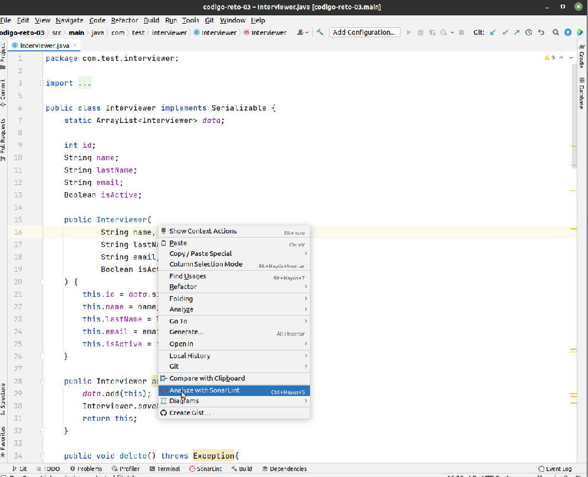
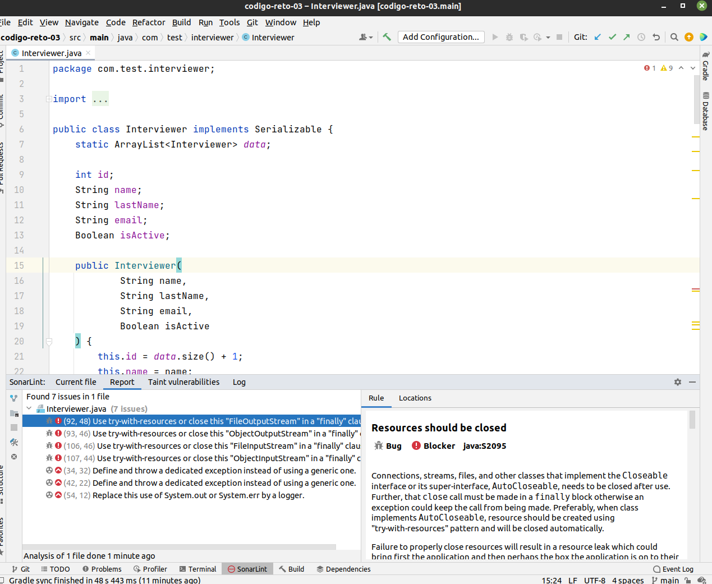

# Ejemplo 3 - SonaLint

## :dart: Objetivos

- Identificar criterios de calidad en el software
- Analizar los criterios de análisis estático del código
- Ejecutar un análisis estático con SonarQube

## ⚙ Requisitos

- IntelliJ IDEA
- Java
- Gradle
- SonarQube
- Docker
- SonarLint

## Desarrollo

### Análisis en tiempo real con SonarLint

Los desarrolladores que utilizan SonarQube en un contexto de integración continua a menudo se enfrentan al problema de
tener que esperar demasiado antes de obtener los resultados del análisis de SonarQube. Deben hacer commit de su código y
esperar el final del proceso de integración continua antes de obtener los resultados del análisis del código.

Para abordar este problema y, por lo tanto, mejorar la vida diaria de los desarrolladores, SonarSource, el editor de
SonarQube, proporciona otra herramienta, SonarLint, que permite el análisis de código en tiempo real.

SonarLint es una herramienta gratuita y de código abierto (https://www.sonarlint.org/) que se descarga de forma
diferente según la herramienta de desarrollo y el lenguaje de desarrollo. SonarLint está disponible para Eclipse,
IntelliJ, Visual Studio y los IDE de código de Visual Studio.

### Instalación de SonarLint

En IntelliJ desde `Settings/Plugins` buscamos `SonarLint` y procedemos a instalarlo.

Después de reiniciar nuestro IDE veremos como SonaLint nos indica los "problemas" en nuestro código.

# Ejemplo 3 - SonaLint

## :dart: Objetivos

- Identificar criterios de calidad en el software
- Analizar los criterios de análisis estático del código
- Ejecutar un análisis estático con SonarQube

## ⚙ Requisitos

- IntelliJ IDEA
- Java
- Gradle
- SonarQube
- Docker
- SonarLint

## Desarrollo

### Análisis en tiempo real con SonarLint

Los desarrolladores que utilizan SonarQube en un contexto de integración continua a menudo se enfrentan al problema de
tener que esperar demasiado antes de obtener los resultados del análisis de SonarQube. Deben hacer commit de su código y
esperar el final del proceso de integración continua antes de obtener los resultados del análisis del código.

Para abordar este problema y, por lo tanto, mejorar la vida diaria de los desarrolladores, SonarSource, el editor de
SonarQube, proporciona otra herramienta, SonarLint, que permite el análisis de código en tiempo real.

SonarLint es una herramienta gratuita y de código abierto (https://www.sonarlint.org/) que se descarga de forma
diferente según la herramienta de desarrollo y el lenguaje de desarrollo. SonarLint está disponible para Eclipse,
IntelliJ, Visual Studio y los IDE de código de Visual Studio.

### Instalación de SonarLint

En IntelliJ desde `Settings/Plugins` buscamos `SonarLint` y procedemos a instalarlo.

Después de reiniciar nuestro IDE veremos como SonaLint nos indica los "problemas" en nuestro código.

### Análisis con SonarLint

Abrimos el archivo que queramos analizar, damos clic derecho y seleccionamos `Analyze with SonarLint`

A continuación abrirá un panel indicándonos los posibles bugs/code smells

